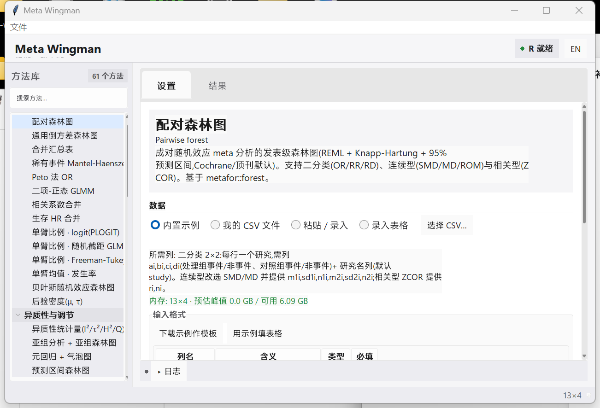

# Meta Wingman

本地运行的 Meta 分析 / 系统评价桌面工具。选一个具体分析、填参数、出图出表,数据不出本机。

它是一个原生 Windows 桌面程序,把 R 的 metafor、meta、netmeta、mada、bayesmeta、metasens、dosresmeta、RTSA 等包封装成点选式界面,省去自己写脚本。覆盖范围接近 RevMan、CMA 与 Stata 的 meta 套件:从效应量换算、核心合并、异质性、发表偏倚,到网络 Meta、诊断准确性、剂量反应、试验序贯分析、GRADE 与 PRISMA。



## 仪表板与交互

- **Apple 风格信息层级**:统一工具栏、材料感方法侧栏、分组设置与清晰结果区;底层使用成熟的 `sv-ttk` 控件状态。
- **方法库导航**:侧栏显示 61 个方法并支持中英文即时搜索;顶部显示 R 环境状态。
- **设置 / 结果分离**:数据与参数在「设置」页,图和表在「结果」页;日志是底部可折叠抽屉,失败时自动展开。
- **键盘操作**:`Ctrl+F` 搜索方法,`Ctrl+1` / `Ctrl+2` 切换设置与结果,`Ctrl+L` 展开或收起日志。
- **中英双语**:右上角切换,首次启动按系统语言显示。

## 下载

两个仓库内容同步,任选其一:

- Gitee(国内较快):https://gitee.com/fsy2004/meta-wingman
- GitHub:https://github.com/fsy2004/meta-wingman

## 安装与启动

需要 Windows,以及 Python 3.9 以上和 R 4.x。版本过低时会给出升级方式,不会自动改动你的 Python / R。

1. 下载 `install.bat` 一个文件（[Gitee](https://gitee.com/fsy2004/meta-wingman/raw/master/install.bat) 或 [GitHub](https://github.com/fsy2004/meta-wingman/raw/master/install.bat)）。
2. 双击 `install.bat`:自动拉取整个应用,并安装 Python / R 依赖(默认用清华镜像)。
3. 双击 `start.bat`:打开桌面窗口。关闭窗口即退出。

## 覆盖的分析

共 61 个具体分析,分 11 类;每一类下是可单独运行的具体图或表,而不是一个大而全的方法。

| 类别 | 举例 |
|------|------|
| 核心合并 | 成对森林、通用倒方差、稀有事件(MH / Peto / GLMM)、比例、相关、生存 HR、贝叶斯 |
| 异质性与调节 | 异质性统计量、亚组、元回归气泡图、预测区间森林、置换检验 |
| 小研究与发表偏倚 | 等高线漏斗、Egger、Begg、剪补法、PET-PEESE、L'Abbé、放射图 |
| 稳健性与影响 | 留一法、Baujat、累积、GOSH、影响诊断 |
| 复杂数据结构 | 三层模型、稳健方差(RVE)、剂量反应(线性 / 样条) |
| 网络 Meta | 网络图、森林、联赛表、SUCRA、秩图、节点分割、成分 NMA 等 |
| 诊断准确性 | 双变量 SROC、敏感度/特异度森林、似然比与诊断 OR、HSROC |
| 序贯与效能 | 试验序贯分析(TSA)、所需信息量 |
| 证据确信度 | E 值、GRADE 证据总表、偏倚风险图 |
| 报告 | PRISMA 2020 流程图 |
| 数据准备与换算 | 中位数/四分位→均值±SD;2×2、均值、相关、CI、p 值→效应量与标准误 |

图统一走 cairo + Arial,按 Nature 制图规范输出矢量 PDF 与 PNG。

## 用自己的数据

不必先把数据改成固定格式。方法页有三种数据来源:

- 内置示例:直接跑,也可作为格式模板下载。
- 我的 CSV:选文件后,把你自己的列名对应到该分析需要的角色即可(程序会先自动猜),不用改列名或预排版。
- 粘贴录入:从 Excel 直接粘贴数据行。

每次选中方法,「输入格式」卡都会显示所需列、必填 / 选填状态、示例前几行和模板下载按钮;载入自己的 CSV 后会自动猜测列映射,缺少必填列时即时提示。不确定某个原始量怎么算成所需格式时,用「数据准备与换算」里的转换器(如 2×2→OR、均值±SD→SMD、median/IQR→均值±SD、CI→SE、p 值→SE)。所有数据只在本机处理。

2026-07-22 对 61 个分析逐项审计:每个分析的主输入都有格式说明和实际存在的内置示例。34 个分析还提供结构化列角色表和自动映射;其余 27 个使用文字规格 + 示例预览,适合网络 Meta、诊断、GRADE、PRISMA、剂量反应等方法各自不同的数据结构。支持多种效应量的页面以默认数据结构显示列卡,其他效应量所需列以同页文字说明为准。

## 结果

运行成功后自动切换到「结果」页,其中分「图」「表」两栏。图可另存 PNG 或矢量 PDF,表可一键复制,也可直接打开输出目录。日志位于底部抽屉;失败时自动展开。运行产物写在 `%LOCALAPPDATA%\MetaWingman\runs`。

## 界面

界面采用 Apple 风格的桌面信息层级,在 Windows 上由 Tkinter + `sv-ttk` 提供原生交互状态。内存红绿灯会按你的数据估算峰值占用。

## 镜像与默认设置

| 项 | 默认 | 可选 |
|----|------|------|
| 应用下载源 | Gitee | GitHub |
| pip / CRAN 源 | 清华 TUNA | 中科大 / 阿里云 / 官方源 |
| 版本门槛 | Python ≥ 3.9,R ≥ 4.0 | 见 `config/requirements.json` |

镜像源列表在 `config/sources.json`,依赖与版本门槛在 `config/requirements.json`,改一处即可。

<details><summary>开发者:从源码运行</summary>

```powershell
powershell -ExecutionPolicy Bypass -File setup\install.ps1   # 安装依赖(默认清华;可传 -PipIndex/-CranRepo 换源)
python setup\env_check.py                                     # 环境体检(可选)
python -m metawingman                                         # 启动桌面应用
```
新增一个分析:在 `toolkit/R/` 写可复用函数,在 `adapters/meta/` 写一个薄适配层,再加一份 `manifests/*.json`(见现有文件)。
</details>

## 目录结构

```
meta-wingman/
├─ metawingman/    桌面程序(Tkinter):方法列表、参数表单、列映射、子进程执行、内存估算、结果导出
├─ adapters/meta/  各分析的命令行适配脚本(共用 _common.R,以 --analysis 选具体输出)与示例数据
├─ manifests/      每个分析一份 JSON(参数 schema、输入角色、分类)
├─ toolkit/        内置的 Meta 分析函数库(R,MIT)
├─ config/         sources.json(镜像源)、requirements.json(依赖与版本门槛)
└─ setup/          环境体检与安装脚本
```

## 许可

内置的 `toolkit/` 来自 [meta-analysis-toolkit](https://github.com/fsy2004/meta-analysis-toolkit)(MIT),封装 metafor、meta、netmeta、mada、bayesmeta、metasens 等已发表方法。本项目采用 MIT 许可。
